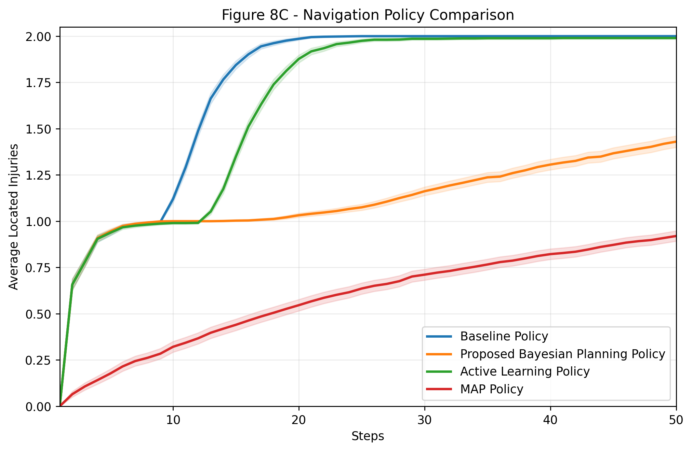
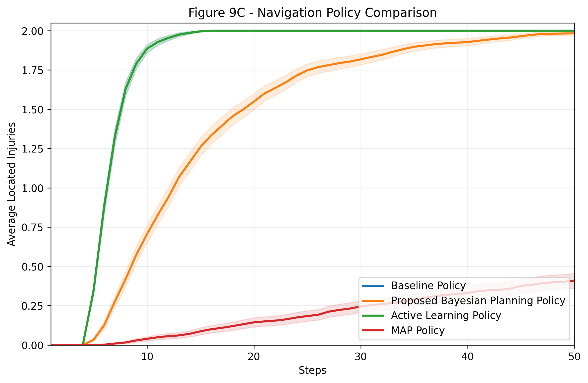
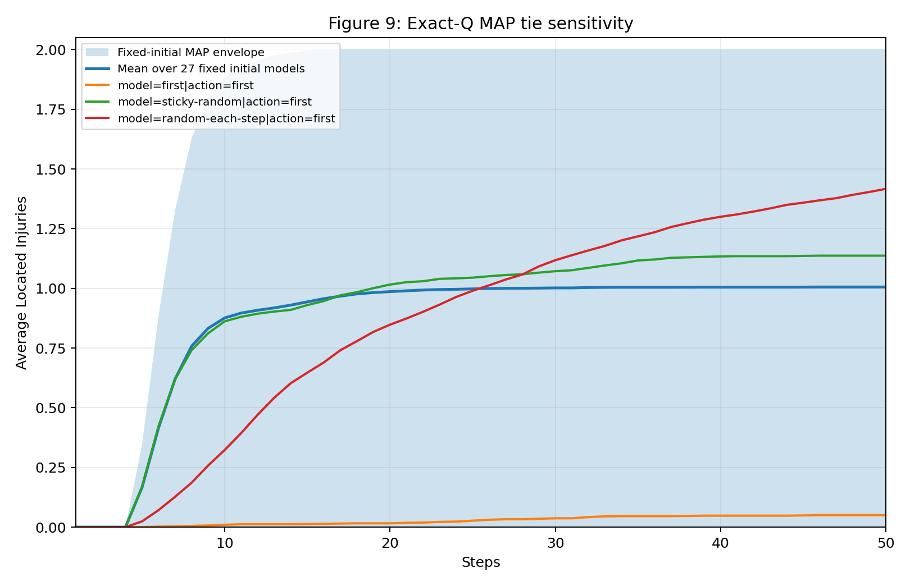
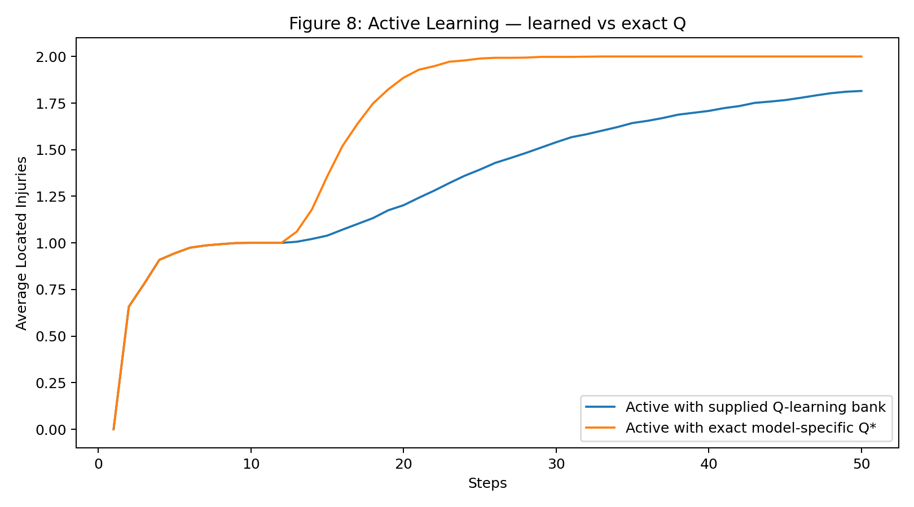

# Bayesian RL Navigation

Reproduction, diagnostic analysis, and ongoing extensions of **Bayesian reinforcement learning for navigation in unknown environments**.

This repository studies Figures 8 and 9 from:

> M. Alali and M. Imani, **“Bayesian reinforcement learning for navigation planning in unknown environments,”** *Frontiers in Artificial Intelligence*, 2024.  
> DOI: https://doi.org/10.3389/frai.2024.1308031

The project started as an independent reproduction of the paper's injury-location experiments and evolved into a diagnostic study of two implementation-sensitive baselines: **MAP planning** and **Active Learning**.

---

## What is implemented

`final_bayesian_navigation.py` contains a standalone implementation of the Figure 8 and Figure 9 experiments, including:

- the 4×4 and 6×6 maze geometries;
- all \(3^3 = 27\) possible environment models;
- Bayesian posterior updates over environment models;
- belief-state transitions;
- stochastic motion with probabilities \(0.8/0.1/0.1\);
- injury tracking through auxiliary \(\eta\) variables;
- the proposed belief-space DQN policy;
- model-specific comparator policies;
- Baseline, MAP, and Active-Learning evaluation;
- 1,000-trial evaluation with 95% confidence intervals;
- internal self-tests and plotting utilities.

The main script also supports **exact model-specific value iteration for MAP only**. Baseline and Active Learning continue to use the supplied learned comparator bank.

---

## Main reproduction results

### Figure 8 — 4×4 maze



### Figure 9 — 6×6 maze



The corresponding numerical results are stored as compressed NumPy files in:

```text
results/main_results/figure8/
results/main_results/figure9/
```

### Reproduction status

| Policy | Status | Notes |
|---|---|---|
| Proposed Bayesian Planning Policy | Reproduced closely | Belief-space DQN implementation follows the reported architecture and hyperparameters |
| Known-model Baseline | Reproduced | Uses a model-specific policy with access to the true environment model |
| MAP | Reproduced after diagnostic analysis | Highly sensitive to unspecified model-level and action-level tie handling |
| Active Learning | Persistent discrepancy | Near-zero performance reported in the paper was not recovered under several reasonable implementations |

---

## Diagnostic finding 1: MAP is highly tie-sensitive

The MAP policy first selects the maximum-posterior environment model and then acts greedily according to that model's Q-function.

For Figures 8 and 9, the initial prior is uniform over all 27 environment models. Therefore, the MAP model is **not unique at the initial state**. A second ambiguity can occur when several actions share the same maximal Q-value.

To separate these effects from neural approximation error, I computed the model-specific optimal Q-functions with exact value iteration and swept the tie-breaking rules.



The experiments show that MAP performance can vary dramatically under different, otherwise reasonable, tie conventions.

The convention used for the final reproduction is:

- **model-level posterior tie:** first maximizer in the deterministic model ordering;
- **model-specific Q source for MAP:** exact value iteration;
- **action-level Q tie:** uniform random choice among exactly tied greedy actions.

Additional MAP diagnostics are available in:

```text
results/diagnostics/map/
experiments/diagnostics/
```

including fixed-initial-model sweeps, action-tie sweeps, and sensitivity plots.

---

## Diagnostic finding 2: Active Learning remains discrepant

The Active-Learning comparator was implemented according to the paper's one-step posterior-weighted model-specific Q rule:

\[
a_k = \arg\max_a \sum_\theta p_k(\theta)\,q_\theta^*(s_k,a).
\]

Unlike the near-zero curves reported for Figures 8 and 9, this implementation performs substantially better.

The discrepancy persisted across several controlled variants:

- model-specific DQNs with common training seeds;
- independently seeded model-specific DQNs;
- tabular Q-learning;
- exact model-specific optimal Q-functions computed by value iteration.

A final diagnostic compared learned tabular Q-values against exact Q-values along the states actually visited by Active Learning.



The learned and exact policies remain broadly aligned, and replacing learned Q-values with exact optimal Q-values improves Active-Learning performance rather than reproducing the reported degradation.

This does **not** establish that the published result is incorrect. It indicates that the reported Active-Learning curve appears to depend on implementation details that are not fully specified in the paper.

Detailed outputs are stored in:

```text
results/diagnostics/active_learning/
```

---

## Initial reproduction

The first reproduction attempt is kept separately from the final curated results:

```text
results/initial_reproduction/
```

This makes the diagnostic process visible rather than presenting only the final plots. The main differences observed in the initial reproduction motivated the MAP tie-breaking and Active-Learning investigations above.

---

## Repository structure

```text
.
├── final_bayesian_navigation.py
├── requirements.txt
├── experiments/
│   └── diagnostics/
│       ├── active_learning_final_diagnostic.py
│       ├── diagnose_active_vs_baseline.py
│       ├── map_exact_q_diagnostic.py
│       ├── map_fixed_initial_model_sweep.py
│       └── map_tie_sweep.py
└── results/
    ├── main_results/
    │   ├── figure8/
    │   └── figure9/
    ├── initial_reproduction/
    │   ├── figure8/
    │   └── figure9/
    └── diagnostics/
        ├── map/
        └── active_learning/
```

---

## Installation

Python 3.10+ is recommended.

```bash
python -m pip install -r requirements.txt
```

The implementation depends only on:

- NumPy
- PyTorch
- Matplotlib

CUDA is optional; the script automatically falls back to CPU.

---

## Running the reproduction

### 1. Run internal checks

```bash
python final_bayesian_navigation.py --figure 8 --mode self-test
```

### 2. Train the proposed policy

Figure 8:

```bash
python final_bayesian_navigation.py \
  --figure 8 \
  --mode train-proposed \
  --episodes 5000 \
  --horizon 250
```

Figure 9:

```bash
python final_bayesian_navigation.py \
  --figure 9 \
  --mode train-proposed \
  --episodes 5000 \
  --horizon 250
```

### 3. Train model-specific neural comparators

Figure 8:

```bash
python final_bayesian_navigation.py \
  --figure 8 \
  --mode train-neural-comparators \
  --comparator-episodes 5000 \
  --comparator-horizon 250
```

Figure 9:

```bash
python final_bayesian_navigation.py \
  --figure 9 \
  --mode train-neural-comparators \
  --comparator-episodes 5000 \
  --comparator-horizon 250
```

### 4. Evaluate all policies

Figure 8:

```bash
python final_bayesian_navigation.py \
  --figure 8 \
  --mode evaluate-all \
  --map-q-backend exact \
  --map-tie-rule first \
  --map-action-tie-rule random \
  --trials 1000 \
  --eval-horizon 50
```

Figure 9:

```bash
python final_bayesian_navigation.py \
  --figure 9 \
  --mode evaluate-all \
  --map-q-backend exact \
  --map-tie-rule first \
  --map-action-tie-rule random \
  --trials 1000 \
  --eval-horizon 50
```

> Training is seed-sensitive, especially for the learned DQN policies. The archived plots in `results/` are included so that the reported reproduction and diagnostics can be inspected without retraining.

---

## Selected diagnostics

### Exact-Q MAP sensitivity

```bash
python experiments/diagnostics/map_exact_q_diagnostic.py \
  --figure 9 \
  --project-file final_bayesian_navigation.py \
  --trials 1000 \
  --horizon 50
```

### Active-Learning learned-vs-exact analysis

The final Active-Learning diagnostic uses a model-specific tabular Q-bank and compares it against exact value-iteration Q-values along evaluated trajectories. See:

```text
experiments/diagnostics/active_learning_final_diagnostic.py
results/diagnostics/active_learning/
```

---

## Implementation assumptions

Some low-level details required for a complete reproduction are not explicitly specified in the paper. This repository therefore keeps those assumptions explicit.

Current assumptions include:

- robot position is one-hot encoded for the neural policy;
- unknown-wall collisions generate an explicit wall observation and leave the robot in place;
- environment models are deterministically enumerated using `W, E, I` for each unknown cell;
- MAP model ties and MAP action ties are handled separately;
- exact value iteration is used for the final MAP comparator to isolate tie behavior from function-approximation noise;
- confidence intervals are computed as mean \(\pm 1.96\,s/\sqrt{N}\).

---

## Extensions

This repository is intended to continue beyond reproduction. Additional experiments will be added separately from the paper-reproduction results so that original findings and new extensions remain clearly distinguished.

Potential directions include robustness to prior misspecification, movement stochasticity, larger uncertainty sets, and alternative information-seeking objectives.

---

## Reference

```bibtex
@article{alali2024bayesian,
  title={Bayesian reinforcement learning for navigation planning in unknown environments},
  author={Alali, Mohammad and Imani, Mahdi},
  journal={Frontiers in Artificial Intelligence},
  volume={7},
  year={2024},
  doi={10.3389/frai.2024.1308031}
}
```

---

## Note

This is an independent reproduction and diagnostic study. It is not an official implementation by the original authors.
